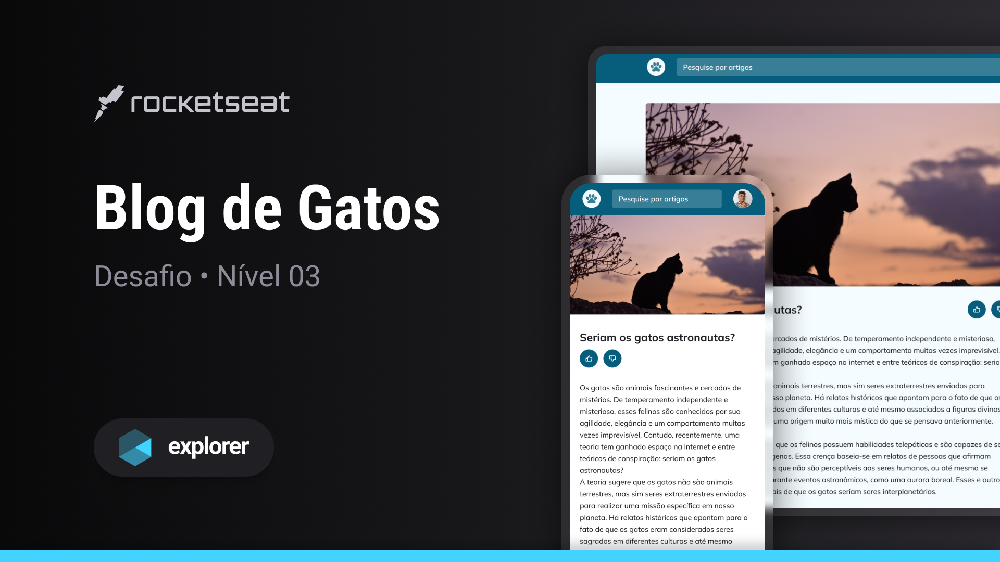

<h1 align="center"> Stage03  Blog de Gatos</h1>

  <a href="#-tecnologias">Tecnologias</a>&nbsp;&nbsp;&nbsp;|&nbsp;&nbsp;&nbsp;
  <a href="#-projeto">Projeto</a>&nbsp;&nbsp;&nbsp;|&nbsp;&nbsp;&nbsp;
  <a href="#-layout">Layout</a>&nbsp;&nbsp;&nbsp;|&nbsp;&nbsp;&nbsp;
  <a href="#memo-licença">Licença</a>

  

 
  

  
  
    

## 🚀 Tecnologias

Esse projeto foi desenvolvido com as seguintes tecnologias:

- HTML 
- CSS
- Git e Github
- Figma

## 💻 Projeto

 Esse desafio consiste em desenvolver um site responsivo de blog com artigos sobre gatos. O projeto também apresenta uma barra de busca, recomendação de artigos relacionados e avaliação do artigo.

  <ul>
  <li>Regra Mobile First</li>
  <li>Unidade de Medida Flexível</li>
  <li>Variáveis</li>
  <li>Animações</li>
  <li>Transições</li>
  <li>Media Queries</li>
  <li>Display Grid</li>

  </ul>
      
 

- [Visite o projeto online]()

 

## 🔖 Layout

Você pode visualizar o layout do projeto através [DESSE LINK](https://www.figma.com/community/file/1256354927622258124/blog-de-gatos-desafio-explorer). É necessário ter conta no [Figma](https://figma.com) para acessá-lo. 

  

## :memo: Licença

Esse projeto está sob a licença MIT.

---

Feito com ♥ by Iara Marques :wave: [Participe da comunidade da RocketSeat!](https://discord.gg/rocketseat)